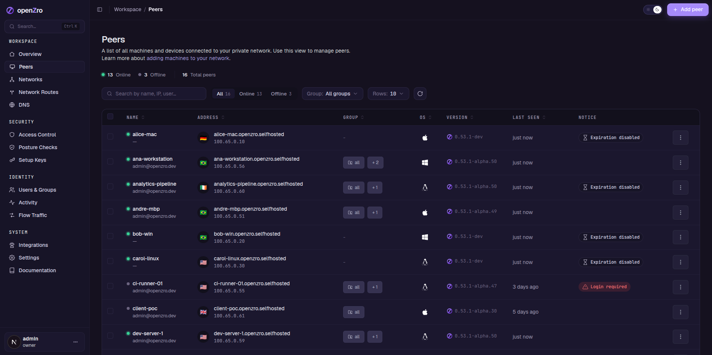
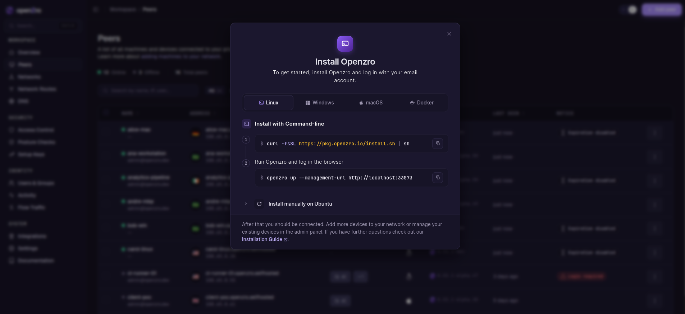
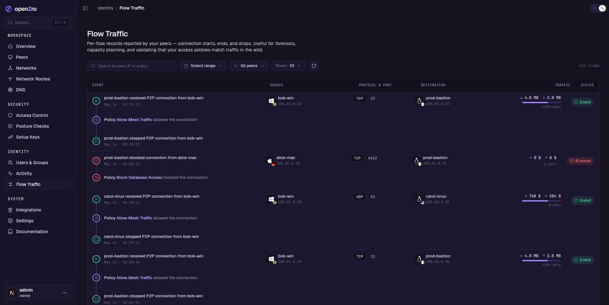
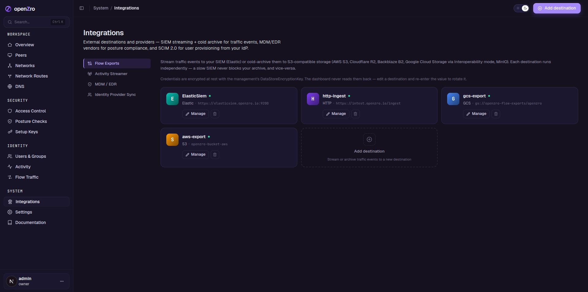

# openZro Dashboard

Web UI for the openZro control plane. Talks to the Management service
over HTTP (REST) for CRUD and gRPC for the long-lived sync streams,
and authenticates the operator against an OpenID Connect issuer
(Dex by default per [ADR-0006](../docs/adr/0006-bundled-idp-dex.md);
any conformant OIDC provider works — Authentik, Keycloak, Auth0,
Okta, Google, Microsoft Entra).

Part of the [openzro/openzro](https://github.com/openzro/openzro)
monorepo — this directory is the Next.js source. The published
container is `openzro/dashboard:<version>` (`<version>` follows the
upstream tag, e.g. `0.53.1-alpha.65`).

## What you can do here

- **Peers** — list every machine connected to the mesh with status,
  IP, OS, group membership, posture results, exit-node role.
- **Groups** — create, rename, delete; bulk-delete unused groups;
  filter by origin (API / JWT / Okta / Google Workspace / Azure AD);
  per-IdP "Manage in &hellip;" link for groups whose lifecycle lives
  in an external identity provider.
- **Access Control (Policies)** — author network policies that gate
  peer-to-peer reachability by group, port, and protocol.
- **Network Resources** — expose subnets and individual hosts as
  routable resources, with per-resource group ACLs.
- **Posture Checks** — gate access on OS, NetBird version,
  geolocation, schedule windows, and MDM compliance signals from
  Microsoft Intune.
- **Routing** — designate routing peers, manage default-route exit
  nodes, configure DNS nameserver groups.
- **Identity** — view users; sync groups from the configured IdP
  via SCIM/JIT; manage service users + setup keys.
- **Activity & Flow Events** — audit timeline of every control-plane
  mutation; flow-traffic view of every connection the data plane
  reported, grouped per source → destination with policy attribution.
- **Settings** — DNS, networks, groups defaults, danger-zone account
  actions.

## Screenshots









## Stack

- **Next.js 14** (App Router, stable line — Next 15 bump tracked
  separately for the DoS advisories, see [`docs/security/advisories.md`](../docs/security/advisories.md)).
- **React 18.3** + TypeScript in strict mode.
- **Tailwind CSS** + the v2 design tokens (`oz2-*` palette) from
  [`tailwind.config.ts`](tailwind.config.ts) and
  [`src/app/globals.css`](src/app/globals.css).
- **Radix UI** primitives + a `components/v2/` set of openZro-flavored
  primitives (`OzButton`, `OzTable`, `OzCheckbox`, &hellip;).
- **SWR** for REST data fetching; **TanStack Table** for the larger
  tables (Peers, Groups, Audit, Flow Traffic).
- **dayjs** as the single date library; **timescape** for the
  segmented date/time inputs.
- **Cypress** for E2E.

## Running in production

The supported path is the [openZro Helm chart](https://github.com/openzro/helms):

```bash
helm repo add openzro https://openzro.github.io/helms
helm install openzro openzro/openzro -f my-values.yaml
```

The chart wires the dashboard to the bundled Dex IdP, the Management
service, and your ingress of choice. See the
[chart README](https://github.com/openzro/helms/tree/main/charts/openzro)
for full `values.yaml` reference and per-IdP examples (Authentik,
Google, Okta, Auth0, Microsoft).

### Standalone Docker

If you're running openZro outside Kubernetes, the dashboard image
takes the following environment variables:

| variable | description |
| --- | --- |
| `AUTH_AUTHORITY` | OIDC issuer URL (e.g. `https://dex.example.com/dex` for the bundled Dex). |
| `AUTH_CLIENT_ID` | OIDC client ID for the dashboard SPA. |
| `AUTH_CLIENT_SECRET` | OIDC client secret (only if your issuer requires it for the auth-code flow). |
| `AUTH_AUDIENCE` | OIDC audience to request. Usually the same as `AUTH_CLIENT_ID`. |
| `AUTH_SUPPORTED_SCOPES` | Space-separated scope list. Default: `openid profile email offline_access api`. |
| `AUTH_REDIRECT_URI` | Public dashboard URL + `/auth`. |
| `AUTH_SILENT_REDIRECT_URI` | Public dashboard URL + `/silent-auth`. |
| `USE_AUTH0` | `"true"` only when your issuer is literally Auth0 (forces the Auth0-specific token shape). `"false"` otherwise. |
| `OPENZRO_MGMT_API_ENDPOINT` | REST URL for the Management service, e.g. `https://api.openzro.example.com`. |
| `OPENZRO_MGMT_GRPC_API_ENDPOINT` | gRPC URL for the Management service, e.g. `https://api.openzro.example.com:443`. |
| `OPENZRO_TOKEN_SOURCE` | `accessToken` (default) or `idToken` depending on which the Management service expects. |

Minimal run:

```bash
docker run -d --name openzro-dashboard \
  -p 8080:80 \
  -e AUTH_AUTHORITY="https://dex.example.com/dex" \
  -e AUTH_CLIENT_ID="openzro-dashboard" \
  -e AUTH_AUDIENCE="openzro-dashboard" \
  -e AUTH_REDIRECT_URI="https://dashboard.example.com/auth" \
  -e AUTH_SILENT_REDIRECT_URI="https://dashboard.example.com/silent-auth" \
  -e AUTH_SUPPORTED_SCOPES="openid profile email offline_access api" \
  -e USE_AUTH0="false" \
  -e OPENZRO_MGMT_API_ENDPOINT="https://api.example.com" \
  -e OPENZRO_MGMT_GRPC_API_ENDPOINT="https://api.example.com:443" \
  openzro/dashboard:latest
```

TLS termination is expected to be handled by an upstream proxy
(ingress, Cloudflare, ALB). The container only exposes HTTP on
port 80.

## Local development

```bash
npm install
cp .local-config.json.example .local-config.json   # if available, otherwise create from config.json
npm run dev
```

The dev server runs on http://localhost:3000. The `.local-config.json`
file overrides the values from `config.json` so you can point the
dev dashboard at a Management service running on `localhost:33071`
(or wherever) and a local Dex on `localhost:5556`.

Useful scripts:

| script | purpose |
| --- | --- |
| `npm run dev` | Next.js dev server with hot reload. |
| `npm run build` | Production build. |
| `npm run start` | Run the production build locally. |
| `npm run lint` | ESLint + simple-import-sort. |
| `npm run cypress:open` | Interactive E2E runner. |
| `npm run cypress:run` | Headless E2E (used in CI). |

## Contributing

The brand and engineering rules that scope this directory live in
[`CLAUDE.md`](CLAUDE.md) (dashboard-specific) and the
[root `CLAUDE.md`](../CLAUDE.md) (project-wide). TL;DR:

- `openZro` always with a capital Z.
- Tailwind utilities first; v2 components live under `components/v2/`
  and carry the `Oz` prefix.
- Behavior changes ship with a Cypress test before the implementation.
- One logical change per commit, signed-off (`git commit -s` — we use
  DCO instead of a CLA).
